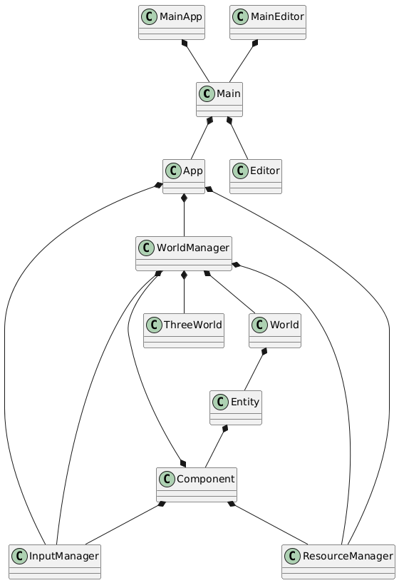

# Version 0.0.1
The current design for the project has two main entry points for the application. Of particular note is the `App` class which stores the `InputManger`, `ResourceManager` and `WorldManager`, all of which need to be easily accessible to each other and to their dependent resources. This is causing a a problem with scalability as each manager needs to inject themselves as a dependency to function and classes that don't actually require the manager, but need access to them to pass it to their children.

See  for refactored design.



```
@startuml

'###################
'Declarations
'###################

class Main
class MainApp
class MainEditor

class App

class InputManager
class ResourceManager
class WorldManager

class World
class Entity
class Component

class ThreeWorld

'###################
'Relationships
'###################

MainApp *-- Main 
MainEditor *-- Main

Main *-- App
Main *-- Editor

App *-- ResourceManager
App *-- WorldManager
App *-- InputManager

WorldManager *-- InputManager
WorldManager *-- ResourceManager
WorldManager *-- World
WorldManager *-- ThreeWorld


World *-- Entity

Entity *-- Component

Component *-- InputManager
Component *-- ResourceManager
Component *-- WorldManager


@enduml
```
