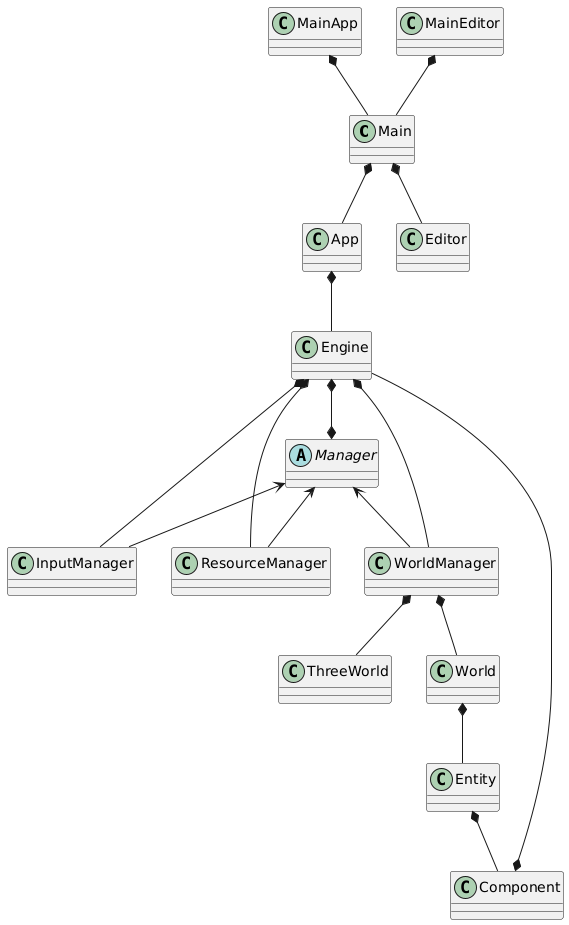

# Version 0.0.2
The new design now adds a central `Engine` class that itself is responsible for every `Manager`. Every manager also stores a reference to the engine. Accessing managers thus just requires indexing into the engine's dictionary where each manager is uniquely identified by their name.



```
@startuml

'###################
'Declarations
'###################

class Main
class MainApp
class MainEditor

class App

class Engine
abstract Manager

class InputManager
class ResourceManager
class WorldManager

class World
class Entity
class Component

class ThreeWorld

'###################
'Relationships
'###################

MainApp *-- Main 
MainEditor *-- Main

Main *-- App
Main *-- Editor

App *-- Engine


Engine *-- InputManager
Engine *-- ResourceManager
Engine *-- WorldManager

Engine *--* Manager

Manager <-- InputManager
Manager <-- ResourceManager
Manager <-- WorldManager

WorldManager *-- World
WorldManager *-- ThreeWorld


World *-- Entity

Entity *-- Component

Component *-- Engine


@enduml
```
